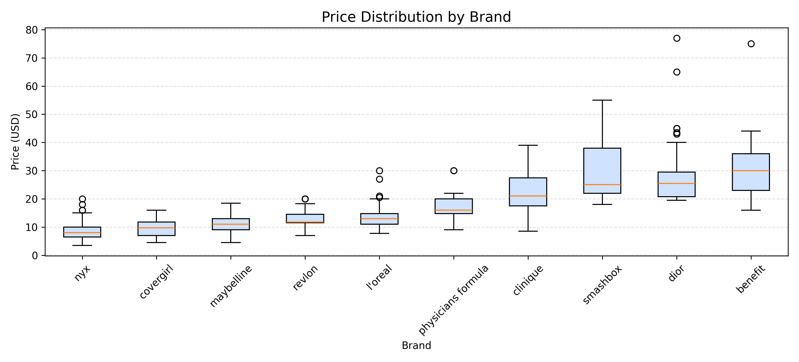
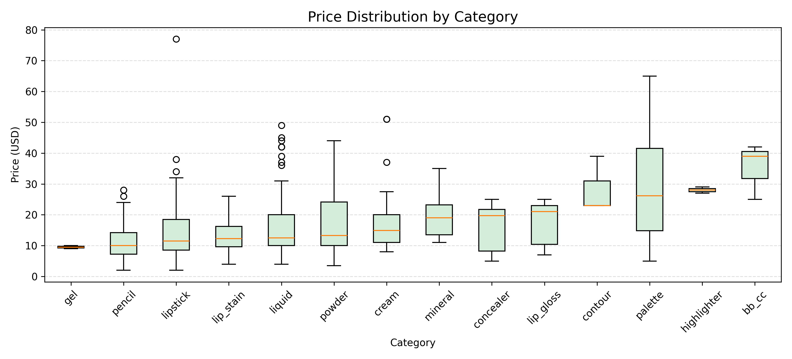
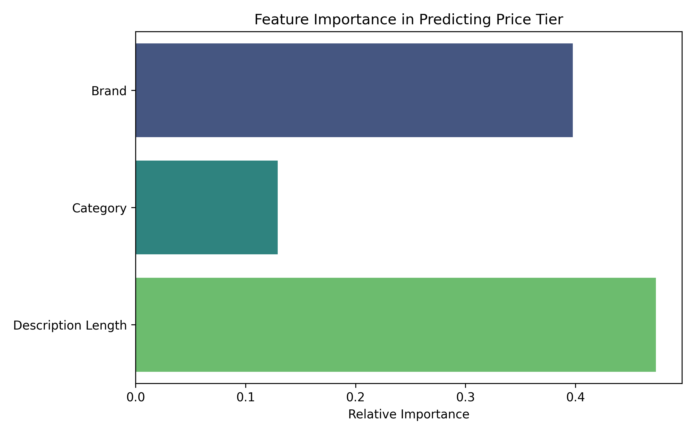

# Is Drugstore vs. Luxury Makeup Still a Real Divide? 💄
### A Machine Learning Analysis of Beauty Pricing

**By: Hadiya Mohammed & Chimaobi Martins Okorie**

## 📖 Introduction & Motivating Question
Walk into any beauty retail store, like Ulta or Sephora, and you will see that the makeup section is divided in a way that feels familiar. Affordable brands are in one area, and high-end brands are in another. A Maybelline lipstick might cost under $10, while a Dior lipstick can cost several times more. 

At first glance, this just seems like a simple drugstore vs. luxury divide. However, the makeup market has changed a lot. Drugstore brands now make products that perform like high-end ones, while some luxury brands sell smaller or simpler products that overlap with mid-range pricing. 

**This leads to the question:** *Is the drugstore vs. luxury makeup divide still real, or are makeup prices better explained by a combination of brand, product category, and product presentation?*

## 🎯 Stakeholders and Why it Matters
This is a multi-million-dollar question for specific stakeholders in the beauty industry:
* **Retail Buyers and Category Managers (Primary):** Professionals at Sephora, Ulta, and Target rely on strict brand-tier segregation. With the rise of "dupe culture," they need to know if physical separation still aligns with reality, or if cross-tier merchandising (e.g., placing an $8 NYX concealer next to a $32 NARS concealer) would drive better sales.
* **Indie Brand Founders (Secondary):** When a new brand enters the market, understanding the hidden mechanics of makeup pricing allows them to confidently position their products without pricing themselves out of a category.

## 📊 Data Source: Ideal vs. Collected
* **The Ideal Dataset:** Real-time global pricing data, exact chemical ingredient lists, packaging material costs, marketing budgets, historical sales volume, and verified customer review sentiment.
* **The Collected Dataset:** A point-in-time snapshot (early 2025) of 931 product listings sourced from Kaggle (generated via the open-source Makeup API). It includes brand, name, price, currency, category, created_at, and description. This dataset provides exactly what we need to analyze consumer-facing retail structures: the direct relationship between brand identity, categorization, marketing presentation, and retail price.

## 🛠️ Methodology & Course Applications
Our project architecture heavily relies on three core data science modules:

### Module 03: Similarity, Dimensionality Reduction, and Cleaning
Raw data is rarely ready for machine learning. We dropped missing prices, standardized text strings, and imputed missing categories with `"unknown_category"`.
* **Feature Engineering (`desc_length`):** We calculated the character count of each product's text description as a proxy for marketing investment.
* **Target Variable:** We binned continuous prices into a categorical `price_tier` target (Drugstore < $15, Mid-range $15-$25, Luxury > $25).
* **Dimensionality Reduction:** We actively chose Label Encoding over One-Hot Encoding for our brands and categories to prevent high dimensionality and sparse matrices.

### Module 06: Supervised Machine Learning
To build our predictive engine, we chose a **Random Forest Classifier**. This specific ensemble method was selected because it handles categorical data exceptionally well, is robust against outliers, and provides a "Feature Importance" output to explain *why* it makes decisions.

### Module 07: Evaluating Your Models
Following Module 07, we evaluated our model on a 30% holdout testing set. The model achieved an overall accuracy score of 75%. However, raw accuracy can be a misleading metric when dealing with imbalanced data (our test set contained 134 Drugstore items compared to only 59 Luxury items). 

To get a more accurate picture, we evaluated the F1-scores. The model was highly confident in identifying budget items, achieving an impressive **F1-score of 0.86 for the Drugstore tier**. Conversely, it struggled more with the "Mid-range" tier (F1-score of 0.58). This makes perfect logical sense, as the boundaries of the "mid-range" market are notoriously blurry in the real world.

## 📈 Key Findings

### Finding 1: Brand Strongly Affects Price

Brand identity is an inescapable anchor for price. The gap between tiers is stepped, not gradual. Brands like NYX produce an immense volume of products but refuse to price anything in the luxury tier, regardless of complexity.

### Finding 2: Product Category Matters, But Brand Matters More

While certain complex formulations (like liquid foundations) have higher baseline costs, the variance *within* identical categories proves that physical utility does not dictate the final retail price. You cannot guess a product's price by knowing it is a mascara; you must know whose logo is on the tube.

### Finding 3: The Predictive Model Supports Brand as a Strong Pricing Signal

When the Random Forest algorithm was forced to rank which pieces of data were most useful in predicting the price tier, **Brand** accounted for the vast majority of the predictive power. Category came in a distant second. The math confirms the visuals: brand equity is the undisputed king of cosmetics pricing.

## ⚠️ Limitations & Ethics
* **Limitations:** The dataset is a snapshot susceptible to holiday sales and inflation. Assuming all currency was USD limits findings to the North American market, and the heavy presence of missing category data (45%) slightly dulls predictive sharpness.
* **Ethics:** This analysis highlights a potentially uncomfortable truth: consumers are largely paying for a name. As data scientists, we recognize our models are mapping *marketing structures*, not necessarily the *intrinsic material value* of the chemical formulations.

---

## 💻 Repository Structure & How to Run the Code

**Files in this Repository:**
* `makeup.csv`: The raw dataset.
* `Final_makeup.py`: The Python script handling cleaning, modeling, and visualization.
* `final_figure1_brand_price.png`: EDA Visualization 1.
* `final_figure2_category_price.png`: EDA Visualization 2.
* `final_figure3_feature_importance.png`: ML Feature Importance Visualization.

**Installation & Execution:**
1. Ensure Python is installed with the required libraries:
   ```bash
   pip install pandas numpy scikit-learn matplotlib seaborn